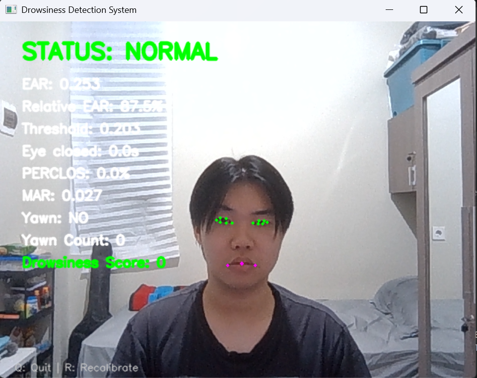

# VigilEye 👁️

**Real-Time Driver Drowsiness Detection System**

VigilEye is a real-time computer vision project designed to detect signs of driver drowsiness using facial landmarks and behavioral indicators.

## Features

- Real-time facial landmark detection
- Personalized eye calibration
- Eye Aspect Ratio (EAR)
- Adaptive eye-closure threshold
- PERCLOS monitoring
- Yawn detection using Mouth Aspect Ratio (MAR)
- Drowsiness scoring
- NORMAL, WARNING, and DROWSY status
- Audio alarm when drowsiness is detected

## How It Works

VigilEye captures real-time video from a webcam and analyzes facial landmarks using MediaPipe.

The system monitors several indicators:

1. **Eye Aspect Ratio (EAR)** to estimate whether the eyes are open or closed.
2. **Eye Closure Duration** to distinguish normal blinking from prolonged eye closure.
3. **PERCLOS** to measure how frequently the eyes are closed over a period of time.
4. **Mouth Aspect Ratio (MAR)** to detect possible yawning.

VigilEye also performs a short personal calibration when the program starts. This creates an adaptive EAR threshold based on the user's natural eye shape instead of using the same fixed threshold for everyone.

## Demo

### Normal Detection



## Installation

Install the required dependencies:

```bash
pip install -r requirements.txt
```

## Run the Application

Run VigilEye using:

```bash
python main.py
```

When the application starts, look directly at the camera and keep your eyes naturally open during the calibration process.

## Controls

- `Q` - Quit the application
- `R` - Recalibrate the eye baseline

## Project Structure

```text
VigilEye/
├── assets/
│   └── alarm.wav
├── alarm.py
├── config.py
├── detector.py
├── main.py
├── requirements.txt
├── .gitignore
└── README.md
```

## Limitations

VigilEye is currently a computer vision prototype. Detection performance may be affected by lighting conditions, camera quality, glasses, facial occlusion, and extreme head poses.

This project is intended for educational and experimental purposes and should not be used as a certified automotive safety system.

## Future Improvements

- Head pose estimation
- Blink frequency analysis
- Low-light optimization
- Detection data visualization
- Dataset-based evaluation
- Machine learning-based drowsiness classification